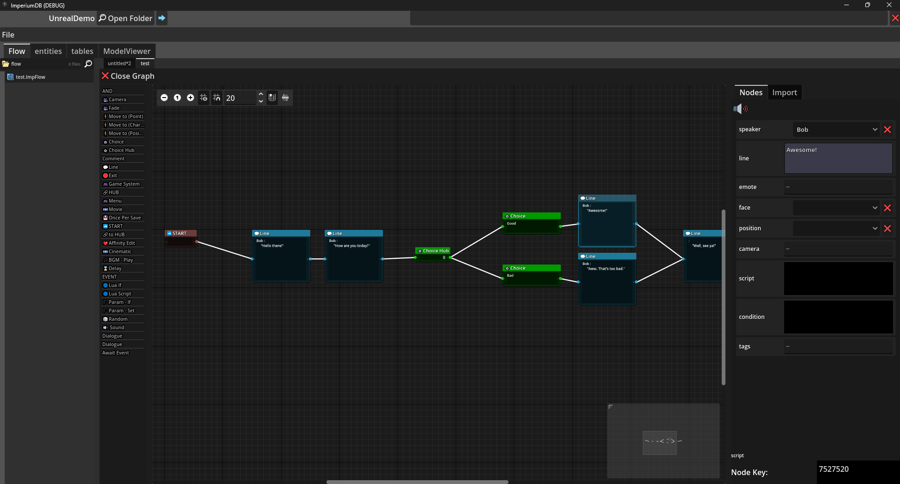

**Imperium DB** is an open-source, non-linear, & engine-agnostic dialogue & database editor for video games, writen in Godot with lua scripting implementation.

Engine Plugins:
* [Unreal Engine](https://github.com/StudioSyndiCatCaius/UnrealPlugin_ImperiumDB)